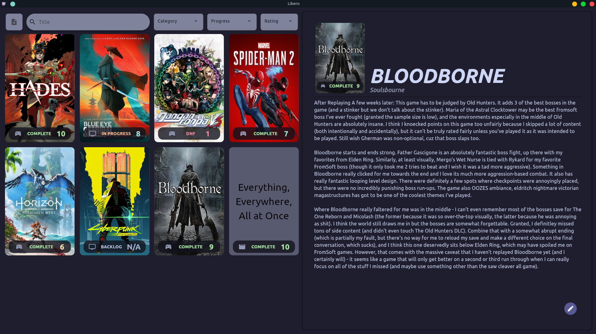
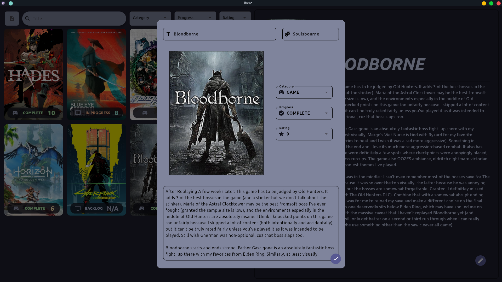

<p align="center">
  
</p>

# Libero

Libero is a toy project for a personal media backlog, meant as some flutter practice. It is named after the
[volleyball position](https://en.wikipedia.org/wiki/Volleyball#Libero). I use it to keep track of my (endless) library of games, books, and things I watch.

Libero has a couple of goals:
1. Backlog tracking for games/movies/tv shows/books along with notes & ratings (fancy spreadsheet).
2. Offline-only storage of data (see the [syncing](#storage--syncing) section below for more detail).
3. (As much as possible) use no external flutter libraries. I wanted to try and build something as "vanilla" as I could.

> [!NOTE] 
> There are (currently) only 3 exceptions to the no external libraries rule, explained below:
> 1. [uuid](https://pub.dev/packages/uuid) - because I didn't want to write the generation logic myself for something that (IMO) should be in the dart stdlib.
> 2. [flie_selector](https://pub.dev/packages/file_selector) - because it's an official package, and because the amount of boilerplate to get a file manager open was not worth it to me.
> 3. [cattppucin](https://pub.dev/packages/catppuccin_flutter) - because it's the color scheme that I personally use for everything, and I have the color palette design talent of a gerbil.

> [!IMPORTANT]
> As mentioned above, I am not (and do not plan to become) a UI designer. Libero is tailored towards me, and the color scheme/layout/etc reflects that. I welcome PRs to improve sins I may have committed.

## Running Locally
### Local snap (recommended)
Ensure that you have [snapcraft](https://snapcraft.io/docs/create-a-new-snap#h-1-snapcraft-setup) installed/configured, and run the following:
```sh
# Build the snap
snapcraft

# install locally. Note that the `--dangerous` flag is necessary since this is a locally built, unsigned snap.
snap install ./libero_0.1.0_<arch>.snap --dangerous

# To uninstall (note that this will remove all data as well!)
snap uninstall libero
```

> [!NOTE]
> YMMV depending on your distro/DE of choice. I have tested on both GNOME 42 and KDE Plasma 5.24 on ubuntu 24.04 with success. Libero **does not** make any network requests, all data is stored locally.

### Build From Source
If you prefer to build the flutter application directly (just creating a binary, no DE integration), instead run:
```sh
# Build
flutter build linux --release

# Run (symlink this binary wherever you want)
./build/linux/<arch>/release/bundle/libero
```
## Storage & Syncing
Libero stores data in `$HOME`. Backlog items are simply encoded as json and stored as an array in `$HOME/libero.json`, while image files are copied when uploaded into `$HOME/libero_data/` and named according to the ID of the item they represent. See the section below on the tradeoffs of this system.

This means that all data is stored locally **only**. Images are not retrieved from an API, nor are title/genre/etc information. Users must add their own images for each item. `png`, `jpg`, and `webp` formats are all supported. I recommend getting cover art from:
- [The Games DB](https://thegamesdb.net/) or [howlongtobeat](https://howlongtobeat.com) for games.
- [The Movie DB](https://www.themoviedb.org) for movies & shows.
- [OpenLibrary](https://openlibrary.org) (which you should donate to!) for books.

If you want to backup/sync your data, you should reference those file paths shown above, using something like [syncthing](https://syncthing.net/) or even just a git LFS repo.

> [!IMPORTANT]
> If you installed Libero as a [local snap application](#local-snap-recommended), data is in the [snap home directory](https://forum.snapcraft.io/t/the-home-interface/7838), which is at `/home/youruser/snap/libero/current/`

## Code Design Notes & Ramblings
Libero started out as a client/server architecture, with the intention of being a full-on "personal dashboard" application. As I kept writing it, though, I realized a couple things:
1. The only part of the app that was actively getting used in my testing was the media backlog.
2. I didn't plan to use the client anywhere but on my desktop.

This lead me to change to a simple client-only app, that does all of its work locally. I amy revisit the server component at a later date, but for now I wanted to keep the thing single-purpose. This does mean that I made some (consciously) ineffecient descisions for the sake of ease of engineering locally, which I'm going to briefly discuss for future me to look back at and point and laugh:
1. **Data is stored in a single json file on-disk, without using a database.**

    I decided on this both for simplicity of code and because in real use, I can't imagine ever having more than a few hundred items stored in Libero at once (and it isn't designed to be a gigantic storage tool anwyay). Additionally, none of the data is built in a way that it needs to be relational (yet, I may regret this if I add a tagging system later), so building a SQL schema that would amount to only 2-3 tables, or even using something like mongodb, felt like overkill.

2. **The app reads the entire backlog content at startup**

    This is obviously inefficient. Reading in the backlog list file is not a particularly expensive operation (especially since it's only once on boot), but were I to do this more "correctly" I would only load in chunks of the file relevant to what the user has already scrolled through. This is a tradeoff I am OK with as it doesn't really cause any noticable slowdown as long as you're not dumping thousands and thousands of things into the backlog.
  
3. **Image files are copied from their original location to a special directory**

    This just makes sure that if a user deletes the original image file (e.g. from their Downloads directory), Libero can still access it. The app doesn't do any compression/resizing/etc, which would be a little bit better than just a straight copy of the image, but it's a simple solution for the problem.

4. **State management is done entirely via `setState`**

    As with one of the project goals lsited above, I wante dto build Libero as "vanilla" flutter as possible, including state management, to better understand how it works. This results in a lot of callback passing, but since the app isn't particularly complex this actually ends up not being too much cognitive overhead. It also keeps me away from the **NINETEEN** external state management libraries listed in the [official flutter docs](https://docs.flutter.dev/data-and-backend/state-mgmt/options). I know a few of them are widely used, but the fact that there are so many is a little smelly to me.

### Known Issues/Missing Features
There are a few things that need to be added for a more "complete" app that I have not gotten to yet. The most notable of them are:
- Graceful handlng of missing image files.
- No way to configure where data is stored (by default it is in `$HOME` as mentioned above).
- No easy export/import functionality (you can copy files around all day but buttons would be nice).
- Various small missing UI tweaks. Nothing glaring, just odd borders and the like. 

## Screenshots

